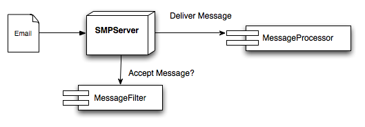



- [Getting Started](#GettingStarted)
- [Overview](#Overview)
- [Message Filters](#MessageFilters)
- [Message Processors](#MessageProcessors)
- [EmailMessage](#EmailMessage)
- [Spooling](#Spooling)

Getting Started
{:.header #GettingStarted}

Simple Mail Processor provides a very easy path to get started while also providing options to add significant complexity.

The first step is to download Simple Mail Processor and its depenencies.  This can be done by downloading the jar files and adding them to your classpath, or by using Maven to download and manage your dependencies.
The Download page provides links to the dependencies and instructions on how to configure your Maven pom.xml file.

Once Simple Mail Processor and its dependencies are in your classpath, you can get started with a simple version that will output all incoming emails to the Console via System.out.  The following code is all that is required for this functionality:

```java
import com.goldeninnovations.smp.SMPServer;
import com.goldeninnovations.smp.messageprocessor.ConsoleMessageProcessor;;

public class SimpleServer
{
    public static void main(String[] args) throws Exception
    {
        SMPServer server = new SMPServer(new ConsoleMessageProcessor());
        server.startServer();
    }
}
```

This code will configure [SMPServer](/apps/simplemailprocessor/api/com/goldeninnovations/smp/SMPServer.html) to use a [ConsoleMessageProcessor](/apps/simplemailprocessor/api/com/goldeninnovations/smp/messageprocessor/ConsoleMessageProcessor.html), which will write out all incomign messages to the console.  By default [SMPServer](/apps/simplemailprocessor/api/com/goldeninnovations/smp/SMPServer.html) listens on port 25 (the default SMTP port).  You may wish to use a different port in development.  Simpley add the line:
`server.setPort(9999);` before server.startServer() to change the default port.  You can now compile and run the applications.  To test it, send an email to your local machine on the specified port.  SMPServer will accept the message and print it out.

Apache's [Commons Email](http://commons.apache.org/email/index.html) can be useful when testing Simple Mail Processor.  The following code can be used to test the default Simple Message Processor example:

```java
import org.apache.commons.mail.*;

public class SimpleClient
{
    public static void main(String[] args) throws Exception
    {
        SimpleEmail email = new SimpleEmail();

        email.setHostName("localhost");
        email.setSmtpPort(9999);

        email.addTo("john.smith@example.com", "John Doe");
        email.setFrom("from@example.com", "Me");
        email.setSubject("Test message");
        email.setMsg("This is a simple test from commons-email");
        email.send();
    }
}
```

Overview
{:.header #Overview}

The [Getting Started](#GettingStarted) section provides a quick example of how to run Simple Message Processor.  However, the power from Simple Message Processor comes from the ability use and extend the pre-defined implementations.  This section will provide an outline of the major components of Simple Message Processor and how to use them.

The [SMPServer](/apps/simplemailprocessor/api/com/goldeninnovations/smp/SMPServer.html) class provides the primary interface between your application and the Simple Message Processor.  [SMPServer](/apps/simplemailprocessor/api/com/goldeninnovations/smp/SMPServer.html) provides methods to allow you to customize the way messages are filtered, spooled, and processed.  The following diagram provides an overview of the components in SMPServer:



The [SMPServer](/apps/simplemailprocessor/api/com/goldeninnovations/smp/SMPServer.html) listens for incoming messages.  Before a message is accepted, [SMPServer](/apps/simplemailprocessor/api/com/goldeninnovations/smp/SMPServer.html) asks the [MessageFilter](/apps/simplemailprocessor/api/com/goldeninnovations/smp/MessageFilter.html) whether or not to accept the message.  If the message is rejected, the remote SMTP sender is notified that the user is invalid.  If the message is accepted, it is spooled for delivery.

Once a message is spooled, it can be processed by a [MessageProcessor](/apps/simplemailprocessor/api/com/goldeninnovations/smp/MessageProcessor.html).  The [MessageProcessor](/apps/simplemailprocessor/api/com/goldeninnovations/smp/MessageProcessor.html) implementation is passed a POJO representation of the email message that provides simplified access to the header fields, as well as processing for multi-part messages.

Simple Message Processor provides predefined implementations of each of these interfaces.  The predefined solutions can be used, or can be extended or replaced by custom implementations.  In most cases, a custom implementation of [MessageProcessor](/apps/simplemailprocessor/api/com/goldeninnovations/smp/MessageProcessor.html) will be used to provide the business logic to process a message.

The spooling step of the process was mentioned in this section.  For more details on message spooling and [SMPServer](/apps/simplemailprocessor/api/com/goldeninnovations/smp/SMPServer.html) threading, please refer to the [Spooling](#Spooling) section.

Message Filters
{:.header #MessageFilters}

The [MessageFilter](/apps/simplemailprocessor/api/com/goldeninnovations/smp/MessageFilter.html) interface provides a single method to implement:
`boolean acceptMessage(EmailAddress recipient, InetAddress senderAddress, EmailAddress sender);`
This method is called while a remote SMTP sender is connected to the SMPServer.  If the method returns true, the email will be accepted.  If not, the email will be rejected with an 'Invalid User' message.

The senderAddress and sender parameters are provided to allow implementaions to create more robust acceptance logic, but in most cases the method will simply evaluate the recipeient parameter to determine if the message should be accepted.

DefaultMessageFilter
{:.subheader}

The [DefaultMessageFilter](/apps/simplemailprocessor/api/com/goldeninnovations/smp/messagefilter/DefaultMessageFilter.html) implementation is used by SMPServer if not other implementation is specified.  This implementation accepts all valid email addresses.

DomainMessageFilter
{:.subheader}

The [DomainMessageFilter](/apps/simplemailprocessor/api/com/goldeninnovations/smp/messagefilter/DomainMessageFilter.html) implementation allows incoming emails to be filtered by domain name.  Multiple domain names can be specified.

MessageFilterChain
{:.subheader}

The [MessageFilterChain](/apps/simplemailprocessor/api/com/goldeninnovations/smp/messagefilter/MessageFilterChain.html) implementation can be used to chain multiple [MessageFilter](/apps/simplemailprocessor/api/com/goldeninnovations/smp/MessageFilter.html) implementations together.  This implementation simply executes each [MessageFilter](/apps/simplemailprocessor/api/com/goldeninnovations/smp/MessageFilter.html) in its chain and return true only if they all accept the message.  This is useful when combining the criteria of multiple [MessageFilter](/apps/simplemailprocessor/api/com/goldeninnovations/smp/MessageFilter.html) implementations.

Message Processors
{:.header #MessageProcessors}

The [MessageProcessor](/apps/simplemailprocessor/api/com/goldeninnovations/smp/MessageProcessor.html) interface provides a single method to implement:
`void processMessage(EmailMessage emailMessage);`
This method is called when an [EmailMessage](/apps/simplemailprocessor/api/com/goldeninnovations/smp/EmailMessage.html) is ready to be processed.  This method is called after the message has been spooled on a seperate thread from the IO processing thread.  See the [Spooling](#Spooling) section for more information on threading and message spooling.

The [MessageProcessor](/apps/simplemailprocessor/api/com/goldeninnovations/smp/MessageProcessor.html) implementation is usually where the primary business logic for your application will be interfaced.  This method should perform whatever functinoality you wish on the incoming message.

MessageProcessorChain
{:.subheader}

The [MessageProcessorChain](/apps/simplemailprocessor/api/com/goldeninnovations/smp/messageprocessor/MessageProcessorChain.html) implementation can be used to chain multiple [MessageProcessor](/apps/simplemailprocessor/api/com/goldeninnovations/smp/MessageProcessor.html) implementations together.  This implementation simply executes each [MessageProcessor](/apps/simplemailprocessor/api/com/goldeninnovations/smp/MessageProcessor.html) in its chain.  This can be useful when combining saving or logging incoming messages with the processing logic.

FileMessageProcessor
{:.subheader}

The [FileMessageProcessor](/apps/simplemailprocessor/api/com/goldeninnovations/smp/messageprocessor/FileMessageProcessor.html) implementation outputs incoming email messages to a text file.  The ouput directory is specified in the constructor, and the filenames are based on a timestamp and counter.  The file nameing logic can be overriden by extending the FileMessageProcessor class and overriding the `public void processMessage(EmailMessage message)` method.

Slf4jMessageProcessor
{:.subheader}

The [ConsoleMessageProcessor](/apps/simplemailprocessor/api/com/goldeninnovations/smp/messageprocessor/Slf4jMessageProcessor.html) implementation outputs incoming email messages to the slf4j logging framework with the Logger name: com.goldeninnovations.smp.messages at level INFO.  This is useful for debugging and can be useful to capture a secondary log of incoming messages.

ConsoleMessageProcessor
{:.subheader}

The [ConsoleMessageProcessor](/apps/simplemailprocessor/api/com/goldeninnovations/smp/messageprocessor/ConsoleMessageProcessor.html) implementation is meant for testing and debugging only.  It simply outputs the message to the console using System.out.

NoOpMessageProcessor
{:.subheader}

The [ConsoleMessageProcessor](/apps/simplemailprocessor/api/com/goldeninnovations/smp/messageprocessor/NoOpMessageProcessor.html) implementation is meant for performance testing only.  This implementation simply disregards incoming emails.

EmailMessage
{:.header #EmailMessage}

The [EmailMessage](/apps/simplemailprocessor/api/com/goldeninnovations/smp/EmailMessage.html) class provides convienence methods to interact with the received email message.  This class provides access to the message headers, as well as processing for multi-part messages.  The [MessagePart](/apps/simplemailprocessor/api/com/goldeninnovations/smp/MessagePart.html) class provides similar convience methods for each [MessagePart](/apps/simplemailprocessor/api/com/goldeninnovations/smp/MessagePart.html).

Attachments are received as MessageParts, and the [MessagePart](/apps/simplemailprocessor/api/com/goldeninnovations/smp/MessagePart.html) class provides convienence methods for writing decoded attachements to an OuputStream.

Spooling
{:.header #Spooling}

The SMPServer creates multiple threads to handle the various aspects of IO and message processing.  SMPServer utilizes a single thread and NIO to processes incoming email messages.  In addition to pure IO, this thread also calls the MessageFilter and MessageSpool iterfaces.  Therefore, it is important that the implementations of those interafaces are fast.

A second thread reads messages from the spool and delivers them to the MessageProcessor.  The default implementation performs all MessageDeliery calls on a single thread.  To achieve greter throuput, use the [MultiThreadedMessageProcessor](/apps/simplemailprocessor/api/com/goldeninnovations/smp/messageprocessor/MultiThreadedMessageProcessor.html) MessageProcessor implementation.  This will create a new thread for each MessageProcessor invocation.

The spooling method itself can also be overriden.  Simple Message Processor currently ships with a single in-memory implemntation although additional file and database implementations are planned for future releases.

MemoryMessageSpool
{:.subheader}

The [MemoryMessageSpool](/apps/simplemailprocessor/api/com/goldeninnovations/smp/messagespool/MemoryMessageSpool.html) implementation provides an in-memory queue for incoming messages.  No persistence or transactionality is supported.
