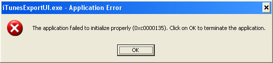

iTunes Export
{:.title}



Frequently Asked Questions (FAQ)
{:.header}

I get an error launching the application: 'The application failed to initialize properly (0xc0000135)'
{:.header}



iTunesExport requires the .Net Framework to run correctly. This error indicates that the .Net Framework is not installed correctly
on the machine.

To resolve this, download the .Net Framework using Windows Update or directly from [Microsoft's site](http://www.microsoft.com/downloads/details.aspx?FamilyID=0856EACB-4362-4B0D-8EDD-AAB15C5E04F5&displaylang=en).

There are three extra characters at the begining of the file.
{:.header}

iTunesExport supports Unicode characters and therefore uses UTF-8 encoding. These characters (EF BB BF) are the Byte Order Markers
that indcate the file type. You can [read more here](http://en.wikipedia.org/wiki/Byte-order_mark).

At this time iTunesExport only supports UTF-8 as an output file. This should not be an issue when using UTF-8 encoding to read the files.
If your playlits contain no non-ASCII characters you can remove these characters.

In the future iTunesExport may support multiple output encoding options.

How do I schedule iTunesExport to run automaticlly?
{:.header}

You can use Windows' Schedule Tasks to schedule iTunesExport to run automaticlly on a schedule you specify.
An example command is below. It should all be on one line but is shown on multiple lines for ease of reading.

```
"C:\Program Files\iTunesExport.Console-1.5\iTunesExport.exe"
    -library="C:\Documents and Settings\USERNAME\My Documents\My Music\iTunes\iTunes Music Library.xml"
   -dir="C:\Documents and Settings\USERNAME\My Documents\My Music\Playlists"
   -prefix="..\iTunes\iTunes Music\"
```
