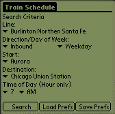
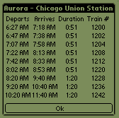
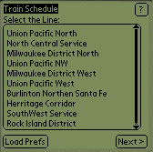
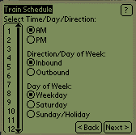
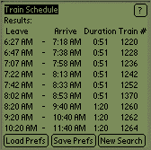

Palm OS Java Train Server
{:.title}

\[[Documentation](#Documentation)\] \[[Download](#Download)\]
\[[History](#History)\]

Note: This project is not current and does not run properly on current Palm hardware.
This page is for historical purposes only.

Introduction
{:.header}

Java Train Schedule is a simple Java application written for the
Palm OS platform. It allows the users an easy way to view commuter train
schedules. Although this application was written for the [Chicago
Metra](http://www.metrarail.com) train system, there is no reason that data from other systems could
not be loaded for this application.

Java Train Schedule is completely free. I wrote it as an introduction
the Sun Microsystems' J2ME CLDC SDK, and the [kAWT](http://www.trantor.de/kawt/index.html)
toolkit.

There are two separate versions of the TrainSchedule application. The
initial version was written using the kAWT toolkit. Once I completed this,
I ported the GUI to use the KVM GUI classes (kJava). While the kAWT
version has much more sophisticated GUI, the kJava version performs much
better. Both versions are included in the binary distribution.

In order to successfully port the application to the kJava classes, I found
the ListBox widget written by Stepane Schmitz invaluable. You can find
more information about this at his [website](http://users.skynet.be/bk233174/java/java-listbox.html).

If you are interested in Java development for the Palm and would like to see
the source code for this application, you can email me at [java@ericdaugherty.com](mailto:java@ericdaugherty.com).

Due to the constraints of the Java KVM, the limited power of the Palm
hardware, and my limited interest, the performance of the TrainSchedule
application is extremely slow. I would only recommend this application for
the fastest Palm hardware, and the very patient! I have found that the
kJava version is much more useable from a performance standpoint.

Download
{:.header #Download}

To download the binaries for the current version:

Version 1.0 - [TrainSchedule1_0.zip](trainschedule1_0.zip)

Currently only supports [Chicago Metra's](http://www.metrarail.com)
[Burlington Northern Santa Fe](http://www.metrarail.com/Sched/bn/bn.html)
and [Union Pacific Northwest](http://www.metrarail.com/Sched/cnw_nw/cnw_nw.html) Lines, weekday schedules only. Please note, I do
not guarantee the accuracy of this information, use it at your own risk.
Although all the lines are listed in the application, searches performed on
any lines besides the two listed above will fail.

You will also need the [xKVM](http://www.trantor.de/kawt/xKVM/DownloadxKVM.html),
which includes Sun's Java KVM and the kAWT class libraries to execute the kAWT
version. If you just wish to run the kJava version, you can download and
install KJava.prc and KjavaUtil.prc from [here](../kvm.zip).

Documentation
{:.header #Documentation}

kAWT Version
{:.sub-header}

Train Schedule is an easy to use application to access basic schedule
information for commuter trains. The application consists of two main
screens. The first screen prompts the user to input their search
criteria. The second screen displays the results of the search.

 

Train Schedule determines all possible trains between your start and
destination, and then filters out any trains that are undesirable (for example,
trains that depart first but arrive after a later train).

Train Schedule also allows the user to define a preferred Line, Start and
Destination. To save your preferences, select the appropriate values on
the main screen, and select Save Prefs. Once you have done this, you can revert
to these values at any time using the Load Prefs button. Also, each time
the application loads, it will initially display the preferred values.

The Time of Day is set to the current hour when the application is
launched. This field is not governed by the Load/Set Prefs feature.

kJava Version
{:.sub-header}

Train Schedule is an easy to use application to access basic schedule
information for commuter trains. The application consists of several data
collection screens, and a results screen. The first screen prompts the user to input
the line they are searching. After you make the selection, press the 'Next
>' button to proceed to the next screen. Once all the data is entered,
the Results Screen will be displayed.

  

Train Schedule determines all possible trains between your start and
destination, and then filters out any trains that are undesirable (for example,
trains that depart first but arrive after a later train).

Train Schedule also allows the user to define a preferred Line, Start and
Destination. To save your preferences, select the appropriate values and
perform a search. On
the results screen, select Save Prefs. Once you have done this, you can revert
to these values at any time using the Load Prefs button.

History
{:.header #History}

1.0 Final (2/2/2001) - Initial Full Release

- Replaced usage of the 3rd Party Date class with java.util.Calendar
- Fixed Bug: Duration is incorrect for trains that leave before midnight but arrive the next day.
- Fixed Bug: Searches with a time of 12 AM are interpreted as Noon.
- Added kJava version to distribution.

1.0 Beta (1/29/2001) - Initial Public Version
